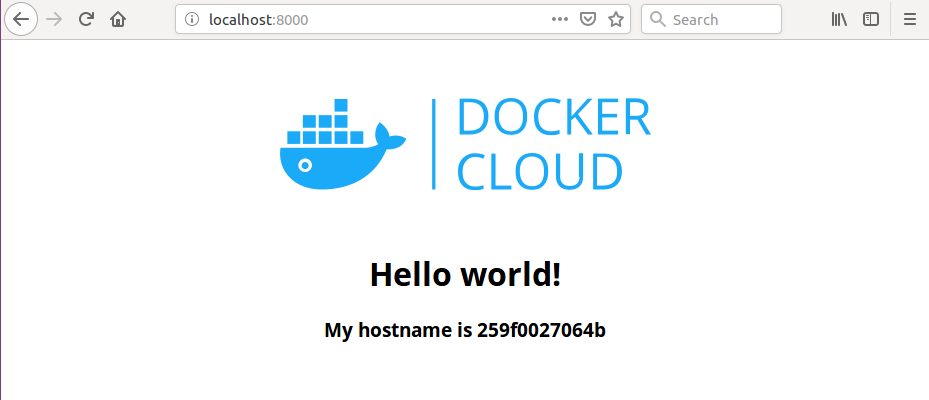
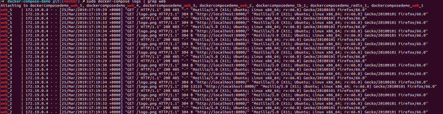

# Docker-SchoolTP

## Run de dockercloud/hello-world

En lancant l'image, et en changeant le port du docker-compose.yml sur 8000, 
on peut observer sur le navigateur, une premiere page affichant hello world.

L'impression écran montre bien que les requetes sont réparties entre les différentes instances du web démarrés avec la commande : docker-compose scale web=5

